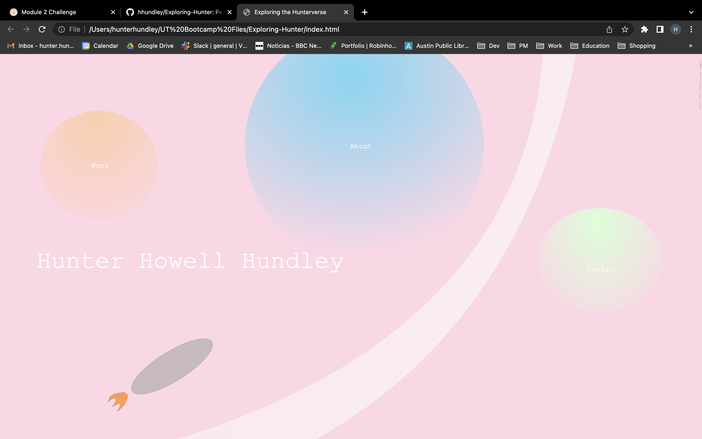
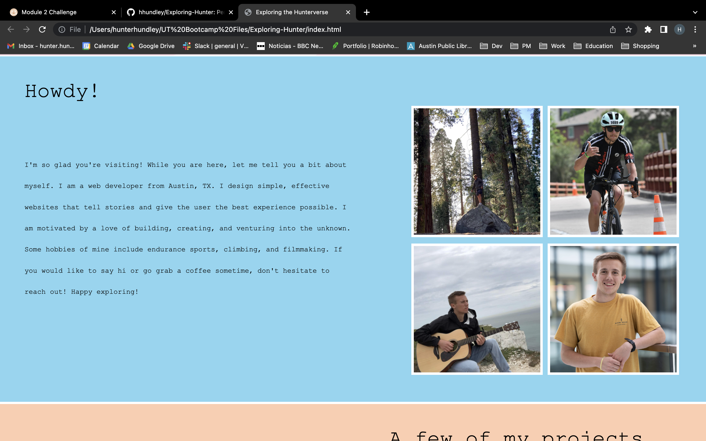
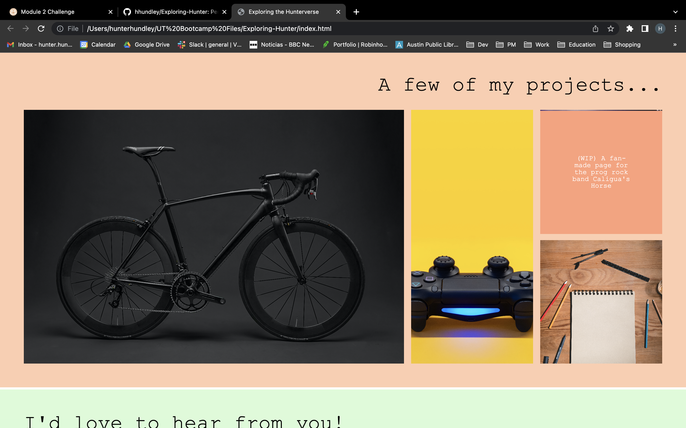
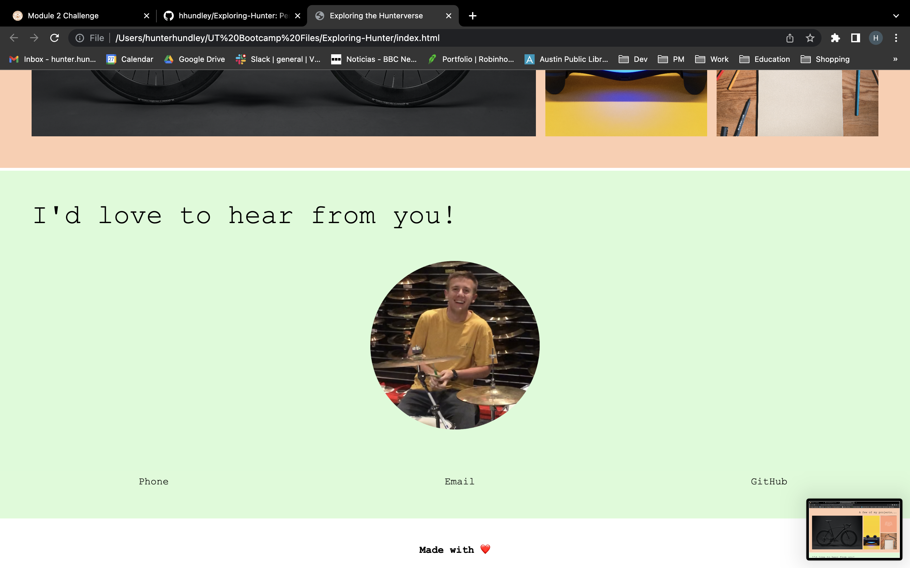

## Exploring-Hunter
#
### DESCRIPTION:
####   Module 2 challenge whereby a personal website/application portfolio waas built from scratch utilizing only HTML and CSS elements in the initial build. The portfolio wioll be an ongoing work in progress as more applications/projects are developed to showcase.
#
### Screenshot:

#
### Deployed Application:
[https://hhundley.github.io/Exploring-Hunter/](https://hhundley.github.io/Exploring-Hunter/)